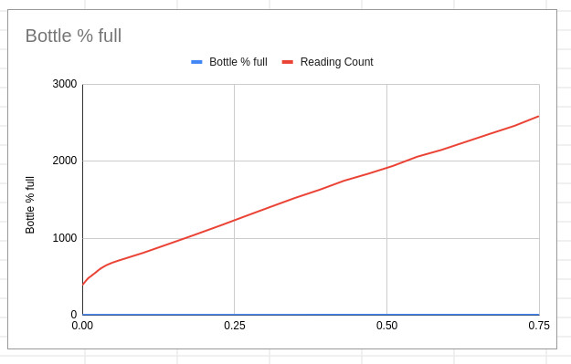
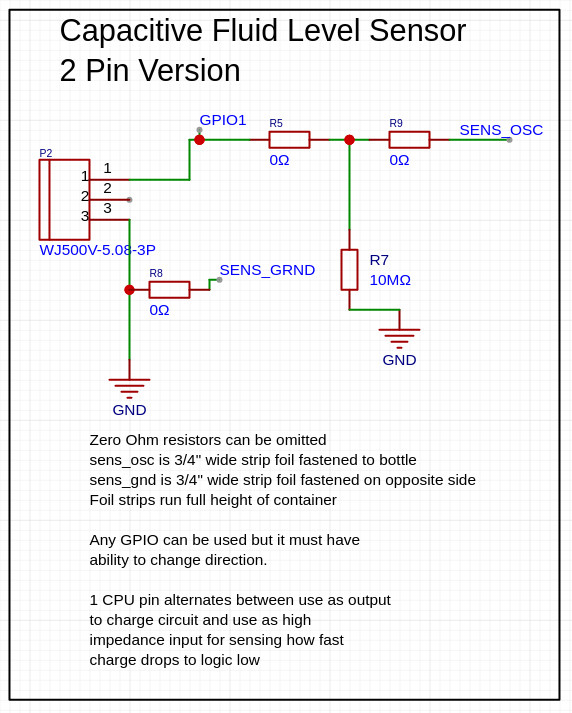
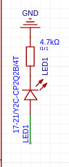
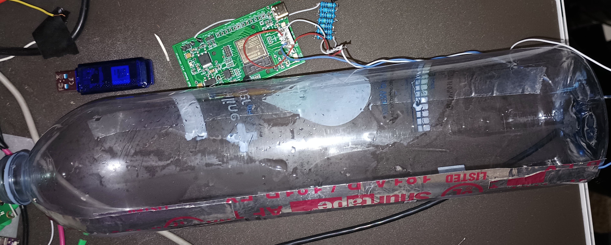
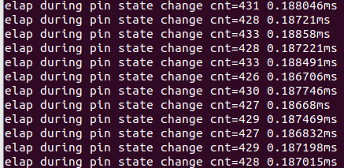
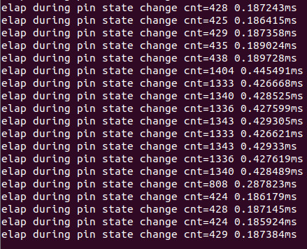
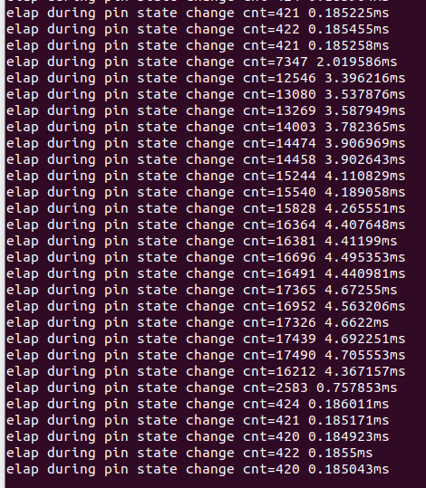
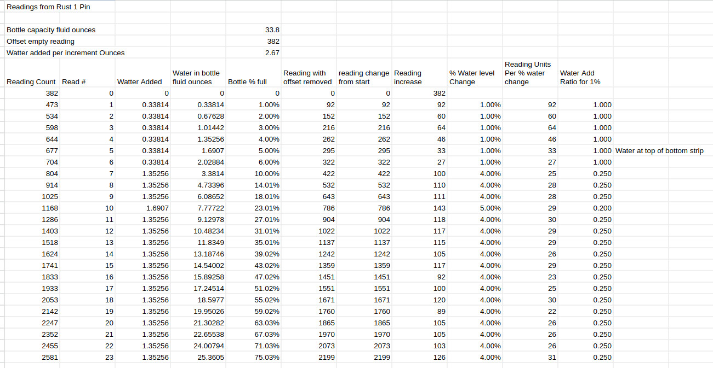

# Measuring Capacitance with Rust on ESP32 CPU using 1 Pin 

## ESP32 Embedded Rust: Measuring Capacitance with Discharge Time

This example demonstrates measuring changes in capacitance by recording the time it takes for a variable capacitor to discharge near VCC (3.3V) to 0.7V through a known resistor.  It does this with only logic level transitions without requiring a ADC
or analog comparator. 

*Tested on esp32-s3-mini-1 on custom RaimAmp.com board on 2024-04-23*

### Fluid Level Sensing in Embedded Rust on ESP32 CPU by measuring change in Capacitance
For testing the electrode will be a two foil strips afixed to 
the outside of a water bottle.  The Capacitance is varied by filling the bottle with various amounts of water.  One strip oscilates from VCC to 0.7V while the other on the opposite side of bottle is connected to ground.  This forms a capacitor with air as the dielectric when empty and water as the dielectric as water is added. As more
water is added capacitance of the circuit increases.

### Human Proximity Sensing. 
This method can also be used to sense human touch. With a large enough sensor, As shown below it can detect changes in human proximity as a person moves closer to or further from the sensor.   With a larger sensor it could easily detects a human moving closer or away within a 1 meter range.

### ESP32 Rust Features Demonstrated:
    - Change GPIO Pin Direction
    - Read GPIO Status
    - Using Polling to detect GPIO status change    
    - Measure elapsed time in Nanosecods
    - Delay for Micro seconds    
    - Delay for Milli seconds
    - Disable debug logging
    - Isolate pin Assignments for each change between boards
    - Converting ints to floats for calcs
    - specifying float constants


#### Please See our [2 pin variable cap read example](../ex-gpio-measure-time-to-change-high-to-low) - It is similar but uses 2 pins to avoid the need to change pin direction.

In therory it should take longer to drain a capacitor from 3V to 0.7V than
it takes to charge it from 0V to 3.3V so this version should be able to
operate with lower resistor values and/or slower CPU speeds without 
sacrificing accuracy.


### Source
- [Rust source main.rs](src/main.rs)
- [Cargo.toml](Cargo.toml)
- [Capacitive fluid level sensor schematic](../ex-gpio-measure-time-to-change-high-to-low/Capacitive-Fluid-Level-Sensor-schematic.epro) for easyEDA pro.


### WHY
Many of my designs rely heavily on capacitive sensing. However, not all my preferred CPUs, such as the ESP C2 and RP2040, have built-in touch sensors. Although the ESP32 does, existing Rust libraries (esp-idf-hal and esp-hal) currently lack Rust-safe wrappers for this functionality.


### Chart of Capacitance Change vs Water level


The linearity of the response is pretty good even though there are variations from imperfect cutting of the foil tape. Preliminary tests show:
- An average of 31 count units per 1% change in water level in the bottle.   
- An average of 57 count units per 1% change in water for the larger bottom electrode     
- A 92 count unit change for first 1% of water added. This significant jump in readings is useful but it must be  accounted for when using this method to measure tank level.  This large reading change as a step function is great for detecting completly empty tank but it makes the first reading appear skewed on the graph.
- The aluminum tape used as sensors was cut by hand and has some minor wrinkles, which will cause some variability in readings.  I have also used aluminum bar,  stainless rods, aluminum and steel tube.


### Algorithm Steps:

1. Drive discharge pin Low and provide enough time for the circuit to fully discharge.  This is critical because any residual charge will affect 
timing in future steps.
1. Change ping to drive High 
1. Allow to charge for a fixed and exact amount of time set to allow 
   charge to very near 3V. Error on longer rather shorter to deliver
   most consistent results. 
2. Change the pin's drive mode to high impedance Read status.
3. Measure the time it takes for a high impedance input pin to discharge
   from Charged Level (3.3V) to logic low approx 0.7V
4. Use fast polling to detect when the circuit Pin state changes 
   from high to low. 

NOTE:  By reducing the charge time we can increase number of reads 
per cycle by allowing capacitor to charge to less than 3.3V before
starting the discharge cycle.   In general slower CPU should allow
more charge time while faster CPU can tolerate less.

### Theory:

Assuming resistance and charge level remain constant, an increase in
capacitance should result in a longer time to discharge the circuit 
before it reaches the transition voltage. Conversely, a decrease 
in capacitance should lead to a shorter charge time.   

To discharge 4pf capacitor through 5M resistor from 3.3V to 0.7V requires 29 micro seconds. This is easy to sense from a CPU running at 120Mhz with 1% sensivity to change.  When using slower CPU cycles such as a 16Mhtz MSPM0 
we would need to increase resistance to provide sufficient CPU cycles to count accurately.  Or we could increase sensor size or move the electrodes closer 
together.
- [../discharge-time-to-capacitance.py](discharge-time-to-capacitance.py)
- [../time-to-discharge-capacitor.py](time-to-discharge-capacitor.py)


### See Also: 
   - https://github.com/esp-rs/esp-idf-hal
   - https://docs.esp-rs.org/esp-idf-hal/esp_idf_hal/
   - https://github.com/esp-rs/esp-idf-hal/tree/master/examples

   When compared to the built in CPU capactive touch pins with 
   vendor supplied libraries this version
   is somewhat less sensitive at least for the units I have tested.  
   It also consumes more CPU power since the built in version on 
   most CPU can have a threashold that when triggered can wake 
   the CPU from sleep.  This version runs with the CPU fully 
   active so it consumes more power during that measurement.  


# Setup
-  See wiring capacitive sensor below

## Expected Wiring

  #### CPU Pin Assignments
  - LED1 - LED Pin on GPIO-11
  - SENS1- GPIO pin used as sensor On GPIO-1
  
  #### sdkconfig.defaults
  Ensure your sdkconfig.defaults include the following settings.  Without them weird logging every time we change the pin direction messed up the timing in our tight 
  loop.   
 ```
  # Turn of log entries every time the pin state changes
  CONFIG_LOG_DEFAULT_LEVEL_NONE=y

  # Provide maximum time before watchdog timer fires so we 
  # can have enough time to complete higher capacitance
  # readings.  Values are 1..60
  CONFIG_ESP_TASK_WDT_TIMEOUT_S=60

  # Not sure why this helped but it seemed to remove erratic
  # delays that messed up timing measurements.
  CONFIG_ESP_DEBUG_STUBS_ENABLE=n

  # Allow 1ms freetos task delays instead of default 10
  CONFIG_FREERTOS_HZ=1000
  ```

  #### Wiring 
  - GPIO Pin ->  LED ->  4.7K resistor -> GND
  - Sense_OSC -> 10M 0.1% resistor -> GND
  - Sense_GND -> GND
  - Alumimum Foil or Tape strip affixed outside of bottle
    Some foil has plastic coating make sure you have zero 
    Ohm measued from connecting wire to Foil. 
    Aluminum tape used was purchased to seal foil backed
    insulation at a hardware store.  Have also used aluminum
    tube, steel flat rod and aluminum plate.
  - Sense_GRND -> GND


  #### Capacitive Sensor schematic
  
  
  #### LED Schematic
  

  I used GPIO 11 for LED on a my custom board.  You will need to find the 
  LED pin for your board and change code to match.


## Running Under Rust
Assuming you installed the Rust Tool chain 
as explained in [linux install](../../linux-install.md)

    # Source this file in every terminal opened
    export IDF_PATH=~/esp/esp-idf
    source $HOME/export-esp.sh
    source $HOME/esp/esp-idf/export.sh
    
    # change directory to location where this 
    # example has been cloned.  
    cd ~/rainampmp/firmware/rust/examples/ex-basic-uart-rs485/

    # Plug in Board 

    # Cargo build will build without trying to flash
    cargo build

    # Cargo run will build, attempt to flash and 
    # open a serial monitor displaying print statement
    # output back to the console. 
    carg run 

## Picture of Circuit board 
I did not have a 8M resistor available but did have a bunch of 1M resistor so soldered them in series to make a 8M resistor.  The RainAmp PCB did not include this capability but I did have extra pins reserved for capacitive sensing so reused them. 


- This Board Features
  - ESP32 S3 Mini 4MB firmware, 2MB PS RAM
  - Power regulator handeling input between 4.5 to 36V
  - DS1820B Temperature sensor
  - I2C pinout with pullups in place
  - 1/2 duplex RS485 transceiver with optional termination
  - 1 Wire header with pullup can repurpose if desolder pullup
  - dht22 header with pullup  can repurpose if desolder pullup
  - 15 Amp low side Motor Driver with activity LED and large buffer capacitors
  - Jtag sel, romp print, spi voltage broken ready header & jumper
  - JTAG connector pins can be repurposed if JTAG not needed
  - 10 available IO pins most with ADC and touch capability
  - 3 pins reserved for capacitive sensing can be repurposed
  If others could benefit from this board then let know what they 
  would be worth to see if we could afford to make them available.
  info@rainamp.com
  

## Picture of Bottle with electrode


## Sample Data with Electrode on Bottle no water


## Sample Data Empty Bottle Human touching electrode sensor
The 400 series readings are from before I touched the bottle.
The 1300 series readings are from when I press my thumb on the +sense electrode.



## Sample Data empty Bottle Human touching both Electrodes same hand
The 400 series of readings are from empty bottle.  Notice how the rose
to over 14,000 when both electrodes where touched then dropped again
as soon as the touch was removed.

This reading shows that if you can design touch button where the human
finger touches both the oscilating electrode and the ground electrode 
at the same time then you get much strong signal to allow non-ambigous
readings. 



## Sample Data Empty Bottle human proximity holding hand 1" from surface
The 420 to 430 range readings are after removing my hand.
The 480 to 490 range readings are when holding my hand 1" from surface of +sense electrode.  These readings show a definite increase in the readings even though I was not touching the electrode. 


## Sample Data from Water Filling a Bottle
For this test I had to add additional aluminum tape to bottom of bottle about 3/4" wide by 1.5" wide to keep the wires from pulling off.  That created a higher 
level of reading change per unit of wire because the electrode was larger. The 
average was 26 units of reading change per 1% of water level change.  At the bottom 
it was closer to 64 units per %.   This shows how minor changes in electrode shape
can modify output.   The first reading when adding only 0.3 ounces to the bottom had
an outsized effect of 92 units. This is is the effect from moving from air filled to at least some fluid and has to be compensated for in software.



# Notes for Improvement
- Use two flat bars close together such as 1/8" and move inside the bottle. Coat them with plastic so they can not interact electrically or corrode. 
this increases capacitance. 
- Keep wire from sensor electrode as short as possible otherwise it picks up electrical noise can can produce erratic readings.
- Need to re-run calibration readings with 1/2 once of water as starting point 
  to better isolate early bump.

        
# About Us 
At our small shop, we combine a deep understanding of physics and
fundamental electronics to achieve results others might deem 
overly complex or expensive. We handle everything in-house, from 
designing circuits and PCBs using discrete components to writing
firmware and integrating with cloud components, machine learning 
and GUIs as needed.  Our key engineer has been a fortune 50 
principal architect, chief enterprise architect,  CTO, venture
funded CEO and holds multiple patents in both software and atmospheric 
water generators.

If you find value in these examples please add a link to our main 
product site https://RainAmp.com to one or more of your sites or 
articles. Please let us know if you add links so we can reference 
them.    If you feel like donating funds to help accelerate these
examples then please contact us info@RainAmp.com    

#### Need help accelerating your impossible project?
If others have told you your project is impossible or will take years, we can help! We excel at taking on challenges others shy away from.

#### Tired of cookie-cutter solutions?
We understand your frustration with engineers who simply slap open-source firmware on existing boards and call it a product? We offer a more tailored approach, engineering unqiue solutions crafted specifically to solve your problems.

#### Let's talk!
If you're looking for a team that can take your project from concept to reality, we'd love to hear from you.