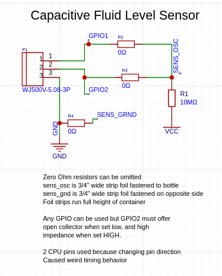
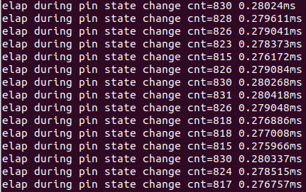
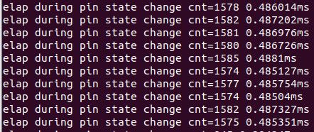
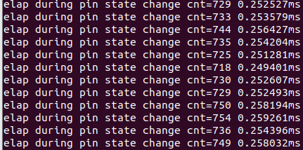
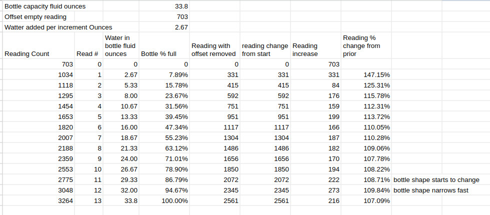

#ESP32 Embedded Rust: Measuring Capacitance with Discharge Time

This example demonstrates measuring changes in capacitance by recording the time it takes for a variable capacitor to discharge.

## Fluid Level Sensing in Embedded Rust on ESP32 CPU by measuring change in Capacitance
This project aims to measure changes in capacitance using a sensor electrode that acts as a variable capacitor. The electrode will be a foil strip taped to a water bottle. This method can be applied to any large enough metallic surface, allowing the CPU sufficient time to detect a voltage rise.

It can be used to sense human touch. With a large enough sensor, it can detect changes in human proximity as a person moves closer to or further from the sensor.

### Source
- [Rust source main.rs](src/main.rs)
- [Cargo.toml](Cargo.toml)
- [Capacitive fluid level sensor schematic](Capacitive-Fluid-Level-Sensor-schematic.epro) for easyEDA pro.

### Our Variable Capacitor
 We tape two aluminum strips on opposite sides of a bottle. One strip oscillates from 0V to a logic high transition at about 0.7V. The second strip is connected to ground and runs on the opposite side of the bottle. This forms a capacitor with air as the dielectric when empty and water as the dielectric as water is added.

**WHY**:Many of my designs rely heavily on capacitive sensing. However, not all my preferred CPUs, such as the ESP C2 and RP2040, have built-in touch sensors. Although the ESP32 does, existing Rust libraries (esp-idf-hal and esp-hal) currently lack Rust-safe wrappers for this functionality.

To avoid the complexities of low-level access through esp-idf-sys, I'm seeking a cross-platform alternative that will work across different CPUs until these libraries are updated.

Tested on esp32-s3-mini-1 on custom RaimAmp.com board on 2024-04-20

### Results and Notes
I'm pretty happy with the linearity and response. There are some variations, but these could easily be caused by my imperfect cutting of the foil tape and the use of a measuring cup and syringe to add water.

There is a significant jump in readings from an empty bottle to a bottle with some water. This jump needs to be accounted for when using this method to measure tank level.

Additionally, the readings accelerate at the end when the bottle tapers. It probably would have been better to stop at 85% full and adjust the total capacity downward.

Even with tanks of variable shapes, interpolation from point to point can be used for accurate estimation.

- Aluminum tape used as sensors was cut by hand and has some minor wrinkles, which will cause some variability in readings. 

- There is a large increase from empty to the first water increment. This is great if you want to measure an empty tank, but it makes the first reading appear skewed. 

- After adding water, some inevitably splashes on the sides, causing higher readings that drop until they reach a baseline after the water has a chance to run down and the sides dry a little. I wasn't perfectly consistent when waiting for this to happen, so some variability was introduced. 

### Steps:

1. Drive discharge pin Low and provide enough time for the circuit to fully discharge.
2. Change the pin's drive mode to high impedance status.
3. Measure the time it takes for a high impedance input pin to charge from 0V to logic 
   high threashold of approximate 0.7v. 
4. Use fast polling to detect when the circuit voltage rises to logic high .

### Theory:

Assuming resistance and charge level remain constant, an increase in capacitance should result in a longer time 
to charge circuit before it reaches the transition voltage. Conversely, a decrease in capacitance should lead to a shorter charge time.   

Time to discharge 4pf capacitor through 5M resistor from 3.3V to 0.7V is 29 micro seconds. This should be easy to sense from a CPU running at 120Mhz with 1% sensivity to change but when using slower CPU cycles such as a 16Mhtz MSPM0 
we would need to increase resistance to provide sufficient CPU cycles to count accurately. 
- [../discharge-time-to-capacitance.py](discharge-time-to-capacitance.py)
- [../time-to-discharge-capacitor.py](time-to-discharge-capacitor.py)

### Justification for approximations:

* The exact voltage level for a read high to read low transition might not be precisely defined. However, for a single CPU pin, the transition tends to be consistent, especially when using oversampling to average out any deviations.
* On a TI MSP430 CPU, a typical pin capacitance of around 26pF is observed. This value serves as a baseline. The variable capacitor will add to or subtract from the discharge time. While ESP32 likely has a different capacitance value, and capacitance might vary slightly between CPUs, it should remain consistent for a single CPU across multiple reads, allowing us to remove it as an offset.

### ESP32 Rust Capabilities demonstrated:**
- Measure elapsed time
- Measure variable capacitance
- Detect change in GPIO state
- Demonstrate Open Drain high-impedance pins 
- Drive I/O pin high 
- Delay for a specific duration
- Read GPIO pin status
- Change OpenDrive GPIO pin mode between Drain and high impedance
- Oversampling to improve reading stability 

### Library Selection:

* `esp-idf-hal`: This example utilizes `esp-idf-hal` because we intend to integrate similar code into a larger application later. We also aim to experiment with the `std::time::duration` feature on ESP32. While `esp-idf-hal` might be suitable for higher-level code, `esp-hal` is generally a better fit for low-level code.

**Note:**

See Also: 
   - https://github.com/esp-rs/esp-idf-hal
   - https://docs.esp-rs.org/esp-idf-hal/esp_idf_hal/
   - https://github.com/esp-rs/esp-idf-hal/tree/master/examples

# Setup
-  See wiring capacitive sensor below

### Diagnosing USB connections in Linux
    # Show a list of currently connected USB devices
    lsusb  
    # Show details about connections
    lsusb -v | more

## Expected Wiring

  #### CPU Pin Assignments
  - LED1 - LED Pin on GPIO-11
  - SENS1- GPIO pin used as sensor On GPIO-1
  - SENS2- GPIO pin used as driver On GPIO-2
      
  #### Wiring 
  - GPIO Pin ->  LED ->  4.7K resistor -> Ground  
  - Sense1 -> 10M 0.1% resistor -> 3.3V
  - Sense1 -> 2" X 4" Alumimum Foil or Tape taped on outside of bottle
              Some foil has plastic coating make sure you have zero 
              Ohm measued from connecting wire to Foil. 
  - Sense2 -> Sense1

  
  #### Capacitive Sensor schematic
  
  
  #### LED Schematic
  

  I used GPIO 11 on a my custom board.  You will need to find the 
  LED pin for your board and use it. 

## Running Under Rust
Assuming you installed the Rust Tool chain 
as explained in [linux install](../../linux-install.md)

    # Source this file in every terminal opened
    export IDF_PATH=~/esp/esp-idf
    source $HOME/export-esp.sh
    source $HOME/esp/esp-idf/export.sh
    
    # change directory to location where this 
    # example has been cloned.  
    cd ~/rainampmp/firmware/rust/examples/ex-basic-uart-rs485/

    # Plug in Board 

    # Cargo build will build without trying to flash
    cargo build

    # Cargo run will build, attempt to flash and 
    # open a serial monitor displaying print statement
    # output back to the console. 
    carg run 

## Picture of Circuit board 
I did not have a 8M resistor available but did have a bunch of 1M resistor so soldered them in series to make a 8M resistor.  The RainAmp PCB did not include this capability but I did have extra pins reserved for capacitive sensing so reused them. 

- This Board Features
  - ESP32 S3 Mini 4MB firmware, 2MB PS RAM
  - Power regulator handeling input between 4.5 to 36V
  - DS1820B Temperature sensor
  - I2C pinout with pullups in place
  - 1/2 duplex RS485 transceiver with optional termination
  - 1 Wire header with pullup can repurpose if desolder pullup
  - dht22 header with pullup  can repurpose if desolder pullup
  - 15 Amp low side Motor Driver with activity LED and large buffer capacitors
  - Jtag sel, romp print, spi voltage broken ready header & jumper
  - JTAG connector pins can be repurposed if JTAG not needed
  - 10 available IO pins most with ADC and touch capability
  - 3 pins reserved for capacitive sensing can be repurposed
  If others could benefit from this board then let know what they 
  would be worth to see if we could afford to make them available.
  info@rainamp.com
  

## Picture of Bottle with electrode

## Sample Data with Bare wire no electrode

## Sample Data with Electrode on Bottle no water

## Sample Data Empty Bottle Human touching electrode sensor

## Sample Data Empty Bottle human proximity holding hand 1" from surface

## Sample Data from Water Filling a Bottle

# Notes for Improvement
- Use two flat bars close together such as 1/8" and move inside the bottle. Coat them with plastic so they can not interact electrically or corrode. 
this increases capacitance. 
- Keep wire from sensor electrode as short as possible otherwise it picks up electrical noise can can produce erratic readings.
- Need to re-run calibration readings with 1/2 once of water as starting point 
  to better isolate early bump.

# Variation from Original design intent
I originally designed this to charge the circuit to 3.3V and through 
a single pin then measure the time it takes discharge to 0.7V thinking
the larger change in voltage would be easier to measure and using only
a single pin.   I found that the rust pin direction change 
added so much variability in timing that it was unworkable.  
The same logic worked in other CPU in C so don't know if it is an issue
in ESP32 or in the ESP32 rust implementation.   Kept the pin state change 
lines commented so we have the syntax documented when rust fixes 
their issues.  

I Think the conversion from input to output we originally
tried failed due to some weird semi random delay when converting
the pin from input to output. 

The code `let mut csense_in = csenseOut.into_input()?;` converted from output pin to 
input pin and did seem to allow us to read state of the pin but it was not reliable 
due to what appeared to be glitchy timing. 

The code `csense_drv.set_low()?;` converted us from input pin back into 
an output pin but conversion seems glitchy with weird timing which
is weird because it seems to work ok in arduino.
        
# About Us 
If you find value in these examples please add a link to our main 
product site https://RainAmp.com to one or more of your sites or 
articles. Please let us know if you add links so we can reference 
them.    If you feel like donating funds to help accelerate these
examples then please contact us info@RainAmp.com    

At our small shop, we combine a deep understanding of physics and fundamental electronics to achieve results others might deem overly complex or expensive. We handle everything in-house, from designing circuits and PCBs using discrete components to writing firmware and integrating with cloud components, 
machine learning and GUIs as needed.

#### Need help accelerating your impossible project?
If others have told you your project is impossible or will take years, we can help! We excel at taking on challenges others shy away from.

#### Tired of cookie-cutter solutions?
We understand your frustration with engineers who simply slap open-source firmware on existing boards and call it a product. We offer a more tailored approach, creating solutions specifically for your needs.

#### Let's talk!
If you're looking for a team that can take your project from concept to reality, we'd love to hear from you.