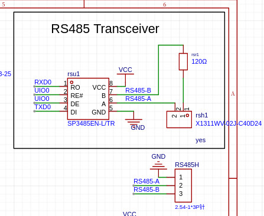

# Rust example Driving simple Uart protocol over RS485
  Reads uart 1 byte
  at a time and writing data back to sender 1 byte at a time with write enable
  pin control to allow use of 1/2 duplex transceiver.    Also toggles GPI driving LED as data is received.
  This is a typical fast poll uart reading strategy we often see in low level C code.
  *esp-hal*

  Note: esp-hal is missing a feature to either query the uart RX buffer or read non-blocking as 
  of 2024-04-120 so could not show that feature.   Have filed a request on the esp-hal git repo.

### Tested on esp32-s3-mini-1 on custom board   2024-04-18
Using esp_hal 0.17 Note there are material changes
    between 0.16 and 0.17
See Also: https://github.com/esp-rs/esp-hal/blob/main/examples/src/bin/gpio_interrupt.rs

- [Rust source main.rs](src/main.rs)
- [Cargo.toml](Cargo.toml)

# Setup
On my system when I plugged in in an USB RS485 module to 
interact over the uart it would not properly initialize the CH340 chip due to a conflict.  To 
remove the conflict i had to remove the brail reader
app.
    
    sudo apt remove brltty 

On my system I also needed to add current user 
to the dialout group.

    # Add your standard user to the group "dialout'

    sudo usermod -a -G dialout your-username

    # Add your standard user to the group "tty"

    sudo usermod -a -G tty your-username

    Logout/Login

### Diagnosing USB connections in Linux
    # Show a list of currently connected USB devices
    lsusb  
    # Show details about connections
    lsusb -v | more

### Starting the serial console to interact
Assumes that you have plugged a USB to RS485 
module into one USB port and that you have your
ESP32 Board plugged into a second USB port.  This
portion will connect to the USB adapter.

    screen /dev/ttyUSB0 115200,cs8

    # To Exit CTRL-A followed by K
    # ttyUSB0 is where my RS485 adapter was
    # installed. 

    See Also: sudo apt-get install putty

## Expected Wiring
  
  betwen RS485-A and RS485-B output.  Assumes 
  a USB RS485 transceiver module to allow
  a 3rd party to reeive and send data.

  #### CPU Pin Assignments
  - LED1 - LED Pin on GPIO-11
  - RXD0 - UART RX Pin on GPIO-44
  - TXD0 - UART TX Pin on GPIO-43
  - UI00 - RS485 Write Enable pin on GPIO-21
  - BOOT/PROG Button on GPIO-0 
    Flash settings default GPIO-0 as high
    with internal pullup other than when pulled
    low.
    board USB-A to UModule USB-A
    board USB-B to UModule USB-B

  #### Wiring 
  - GPIO Pin ->  LED ->  4.7K resistor -> Ground
  - BOOT Pin -> Swith Normal Open -> Ground, 
  - BOOT Pin -> 100nf Capacitor -> Ground
  - Soldered RSH1 jumper to add 120 ohm termination
  
  #### RS485 Transceiver schematic
  
  
  #### Bootmode Schematic
  We use the Botmode button as user input
  since it is the only button we have available
  on the custom board.
  
  
  
  #### LED Schematic
  

  If LED does not blink try flipping it around since 
  current can only flow 1 way thorugh a LED.

  I used GPIO 11 on a my custom board.  You will need to find the 
  LED pin for your board and use it. 

### NOTE: 
This version uses esp_hal instead of esp_idf_hal because I planned to use the esp_hal in other parts of our project  

## Running Under Rust
Assuming you installed the Rust Tool chain 
as explained in [linux install](../../linux-install.md)

    # Source this file in every terminal opened
    export IDF_PATH=~/esp/esp-idf
    source $HOME/export-esp.sh
    source $HOME/esp/esp-idf/export.sh
    
    # change directory to location where this 
    # example has been cloned.  
    cd ~/rainampmp/firmware/rust/examples/ex-basic-uart-rs485/

    # Plug in Board 

    # Cargo build will build without trying to flash
    cargo build

    # Cargo run will build, attempt to flash and 
    # open a serial monitor displaying print statement
    # output back to the console. 
    carg run 

